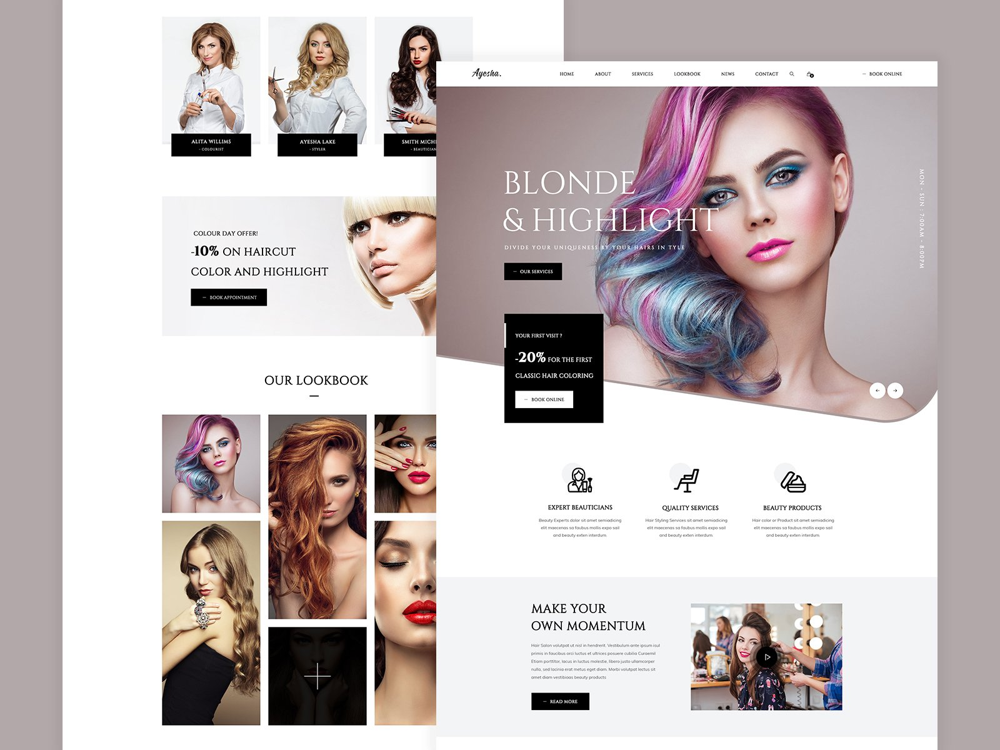

# Hair Salon SITE: [Visit Here](https://hairsalonayesha.netlify.app/)

This is a single page responsive site for a Hair Salon. Design is taken from the picture/wireframe given below. All the layout is completed using floats or display property. The challenge is to complete the layout without using css grid or flexbox. The site is available online for visit [here](https://hairsalonayesha.netlify.app/). 

### Purpose: 

The purpose is to write responsive CSS without relying on CSS grid or flexbox. This sharpens the skill to understand complex CSS concepts like floats and clears. 

### Design Concept:

### Languages and Tools:

    

